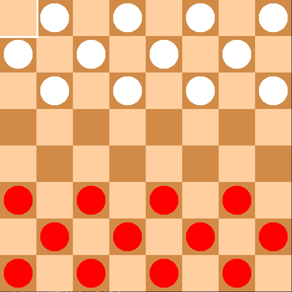

# Immersive Checkers

---
## Overview

## Build
`$ cmake -B build -DCMAKE_BUILD_TYPE=Release`

`$ cmake --build build --config Release`

## Run
`$ ./build/immersive-checkers`

## Controls
- Use mouse to move camera
- Use WASD to move player
- Use space to jump

## Dependencies
- SFML
- BOOST LOG

## References
- [LearnOpenGL](https://learnopengl.com/)
- [OpenGL 4 Shading Language Cookbook](https://www.packtpub.com/game-development/opengl-4-shading-language-cookbook)
- [OpenGL SuperBible](https://www.oreilly.com/library/view/opengl-superbible-8th/9780134174697/)
- [SFML](https://www.sfml-dev.org/)
- [Boost](https://www.boost.org/)

## Play
Build and play the game by running the following command:

`$ cmake --build build --target checkers -- -j 2`

---
## Design

